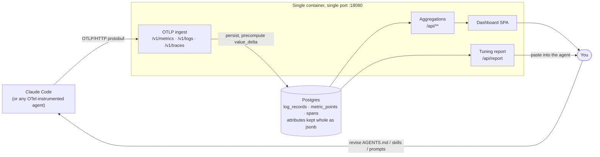

# Agent Compass

[](https://github.com/guavasoftcom/agent-compass/releases/latest)
[](https://github.com/guavasoftcom/agent-compass/actions/workflows/pull-request.yml)
[](https://github.com/guavasoftcom/agent-compass/pkgs/container/agent-compass)
[](LICENSE)

OTLP/HTTP telemetry sink + Postgres store + markdown tuning report + React/MUI dashboard for coding-agent self-tuning.

## What this is

Coding agents like Claude Code already emit OpenTelemetry — every tool call, token, dollar, and
error. That telemetry usually disappears into a vendor dashboard built for microservices, where it
answers questions about *services* rather than about how the agent actually works.

Agent Compass is a self-hosted place to send it instead. It ingests the agent's OTLP stream, stores
it in Postgres, and turns it back into two things you can act on: a dashboard for exploring what the
agent did, and a markdown report you paste back into the agent so it can revise its own `AGENTS.md`,
skills, and prompts. The loop is the point — the agent's own trace data becomes the evidence for
tuning the agent.

### What it does

- **Ingests** OTLP/HTTP protobuf logs, metrics, and traces directly — no collector, no agent-side
  shim, no vendor SDK. Point the standard `OTEL_EXPORTER_OTLP_*` env vars at it and data flows.
- **Stores** every log record, metric point, and span in Postgres, with attribute maps kept whole in
  `jsonb` so nothing is flattened away at write time.
- **Aggregates** the raw signal into the questions that matter for agent tuning: which tools fail and
  why, which file reads were redundant, where edits looped, what filled the context window, what the
  session actually cost, and which prompts drove it.

### What it provides

- A **markdown tuning report** (`GET /api/report`) — failures by root cause, path near-misses,
  redundant reads, edit failure loops, Bash hotspots, tool performance and call mix, context
  footprint, oversized results. Written to be pasted straight into a coding-agent chat, and filtered
  down to rows a rule in `AGENTS.md` could actually change.
- A **dashboard** over the same data — tool usage, token usage and cost, sessions with per-turn
  prompt timelines, plus full logs / metrics / traces explorers with faceted filtering and live tail.
- A **JSON API** (`/api/**`, documented via Swagger UI) if you'd rather build your own view.
- A **single Docker image** carrying both halves of the app, and a plain-OTLP design that leaves you
  free to move the data anywhere else later.

### What it stores, and what guards it

Worth knowing before you point anything at it. To make the report and the prompt-level views work,
the recommended Claude Code configuration ([docs/local-docker-deployment.md](docs/local-docker-deployment.md#point-claude-code-at-it))
turns on content capture — `OTEL_LOG_USER_PROMPTS`, `OTEL_LOG_ASSISTANT_RESPONSES`,
`OTEL_LOG_TOOL_DETAILS` / `OTEL_LOG_TOOL_CONTENT`, `OTEL_LOG_RAW_API_BODIES` — with
`CLAUDE_CODE_OTEL_CONTENT_MAX_LENGTH` set high enough not to truncate. So your Postgres ends up
holding **full prompt text, assistant responses, tool inputs and results, and raw API bodies** from
your sessions. That's not incidental: it's what bash anti-pattern detection, redundant-read and path
near-miss analysis, and the per-turn prompt timeline actually read. Drop those switches and the
corresponding sections go quiet rather than wrong.

There is **no authentication on any endpoint** — no Spring Security on the classpath, no API key on
ingest. Anything that can reach the port can push telemetry *and* read every stored prompt. That is
a reasonable trade on `localhost`, which is what this is built for; exposing it beyond your own
machine means putting your own auth in front of it (reverse proxy, network policy, whatever you
already run). This is the same reason self-hosting is the design rather than a feature: the data is
sensitive enough that shipping it to someone else's dashboard is the part worth avoiding.

Nothing is ever deleted, either — there is no retention window, TTL, or cleanup job, so the database
grows for as long as you keep feeding it, and with content capture on it grows quickly. Trimming it
is manual; the **Settings** page measures what a given cutoff would reclaim and will either hand you
the SQL or run the purge for you, behind a type-to-confirm dialog. See [Run](#run).

End-to-end flow — note that it closes: the agent's own telemetry comes back to it as a report it can act on.



Coding agents push **OTLP/HTTP protobuf** straight at the backend — no collector in between. Every log record, metric point, and span lands in Postgres with its attribute map kept whole in `jsonb`; the aggregations on top feed both the React + Material UI dashboard and the markdown report you paste back into the agent.

## Repository layout

- `backend/` — Spring Boot 4.1 (Java 21), Spring Data JPA, `opentelemetry-proto`, Postgres.
- `frontend/` — React + Vite + Material UI (charts and tables are hand-built SVG/CSS — no `@mui/x-charts` or `@mui/x-data-grid`), TanStack Query, React Router.

## Quick start

To *use* Agent Compass you need Docker and Claude Code — no JDK, no Node. [install.sh](install.sh) fetches the released image's compose stack, points Claude Code's telemetry at it, and starts it:

```sh
git clone https://github.com/guavasoftcom/agent-compass.git
cd agent-compass && ./install.sh
```

Once the repository is public, the same thing without the clone:

```sh
curl -fsSL https://raw.githubusercontent.com/guavasoftcom/agent-compass/main/install.sh | bash
```

The dashboard comes up on <http://localhost:18080>. Your `~/.claude/settings.json` is backed up before the telemetry env block is merged in, and the script prints the command that restores it. `./install.sh --help` covers the flags — `--port`, `--project` (scope the settings to one repository), `--with-hook`, `--no-start`, `--skip-settings`. Details, and what each telemetry variable feeds, in [docs/local-docker-deployment.md](docs/local-docker-deployment.md).

Everything below is for running from source.

## Prerequisites

- JDK 21+ (the backend compiles with `--release 21`)
- No Maven install required — use the bundled wrapper (`./mvnw` / `./mvnw.cmd`), pinned to Maven 3.9.9
- Node 20+ (CI builds on 22) and Yarn Berry — the exact version is pinned by the `packageManager` field in [frontend/package.json](frontend/package.json), so `corepack enable` is enough; no global Yarn install needed
- Docker (for the Postgres compose service and for running the Testcontainers integration test)

## Run

The backend has `spring-boot-docker-compose` on the classpath, so `./mvnw spring-boot:run` will automatically start the Postgres service declared in [backend/docker-compose.yml](backend/docker-compose.yml), wire its `JdbcConnectionDetails` into the app via `@ServiceConnection`, and stop the container when the app shuts down.

```sh
# Terminal 1 — backend (port 8080). Postgres comes along for the ride.
cd backend
./mvnw spring-boot:run

# Terminal 2 — frontend dev server (port 5173, proxies /api → :8080)
cd frontend
yarn install
yarn dev
```

Open <http://localhost:5173> for the dashboard, or <http://localhost:8080/swagger-ui.html> for the OpenAPI / Swagger UI.

To run the released image instead of the dev servers — API and dashboard in one container, on one port — see [docs/local-docker-deployment.md](docs/local-docker-deployment.md) and the [docker-compose.yml](docker-compose.yml) beside it.

Flyway creates and migrates the schema on startup (`backend/src/main/resources/db/migration/`); Hibernate runs with `ddl-auto=validate` and fails fast if the entity model and DB drift.

Reclaiming space is manual — nothing prunes old telemetry, so trimming means a `DELETE ... WHERE timestamp < ...` against `log_records`, `metric_points`, and `spans`. The **Settings** page does this for you. Pick a retention window and it reports the exact rows and estimated bytes each table would give up; from there, either copy the script into `psql` or press **Purge now** and confirm. The purge is the only endpoint in the application that deletes anything (`DELETE /api/system/telemetry`), it requires an explicit confirmation phrase, and it cannot be undone.

The purge deletes **whole sessions, not rows**. `session.id` sits in the attribute payload of all
three tables, so the purge computes every session whose last activity anywhere — logs, tokens, or
traces — is older than the cutoff, and only ever deletes a session that qualifies. A session with any
recent activity is left completely alone, including its oldest rows: a plain `timestamp < cutoff`
delete would otherwise split a session straddling the cutoff, silently understating its lifetime cost
and truncating its prompt timeline. Measured on the live database, 0 sessions straddle the default
30-day window but 21 straddle a 7-day one, accounting for 604k rows that a row-level delete would
have partially removed.

Five things worth knowing before you run it:

- **Run it while no agent is exporting.** The delete holds locks on all three tables for as long as it takes — minutes, on a large database — and telemetry arriving meanwhile queues behind it. An exporter that gives up drops those events permanently.
- **Space is made reusable, not returned.** Postgres will refill the freed pages, but the files stay their current size on disk until a `VACUUM FULL`, which needs an exclusive lock and room for a full rewrite. The purge response hands you that statement rather than running it.
- **A qualifying session is cut from all three tables in one transaction**, at the same instant, computed from a single shared set of dormant session ids.
- **Inside a session that does get purged, the newest row of every metric stream still survives, whatever its age.** `value_delta` is computed at ingest against a row's predecessor, and Claude Code re-emits every counter for the life of the process — so a stream left without one would book its entire cumulative total as a single increment on its next emission, spiking every token and cost figure on the dashboard. Session dormancy alone is strong evidence that won't happen (a live process can't stay silent that long) but not a proof of it — no confirmed mechanism reactivates a purged session id (it is specifically *not* known to be `claude --resume`, which mints a disjoint, never-before-seen id for what it emits, rather than reactivating an old one), but none has been ruled out either, so the marker stays regardless of session state as a defensive measure rather than a response to a known trigger. The preview reports the count, and the copyable SQL carries the same clause.
- **This retention window is independent of Claude Code's own `cleanupPeriodDays`** (the local setting controlling how long a session stays resumable on your machine, default 30 days) — this application has no way to see that setting, since it's never sent as telemetry. If you purge more aggressively than `cleanupPeriodDays`, a session can still be resumable in Claude Code after its telemetry — prompt timeline, tool calls, cost breakdown — is already gone from the dashboard: the conversation continues normally, but Sessions/Logs/Traces show that session's history starting only at the resume point. Set the retention window at least as long as `cleanupPeriodDays` if you want dashboard history to survive as long as your sessions stay resumable.

If you'd rather use an existing Postgres (no Docker), set `SPRING_DATASOURCE_URL` / `SPRING_DATASOURCE_USERNAME` / `SPRING_DATASOURCE_PASSWORD` env vars before starting the backend — see [backend/.env.example](backend/.env.example). The compose support backs off when explicit datasource properties are present.

## Pointing your coding agent at the backend

For any OTel-instrumented agent, set the standard OTLP env vars to send protobuf-over-HTTP to this backend:

```sh
export OTEL_EXPORTER_OTLP_PROTOCOL=http/protobuf
export OTEL_EXPORTER_OTLP_ENDPOINT=http://localhost:8080
# Optional: speed up debugging
export OTEL_METRIC_EXPORT_INTERVAL=10000
```

For Claude Code specifically, telemetry is off until you enable it, and metrics, logs, and traces each have their own exporter switch — [docs/local-docker-deployment.md](docs/local-docker-deployment.md#point-claude-code-at-it) has the full set (including the `~/.claude/settings.json` form), what each one feeds in the dashboard, and how to verify data is flowing.

Claude Code emits its tool-decision counter as `claude_code.code_edit_tool.decision` with a `tool` attribute. The defaults in `application.yml` and the report endpoint assume this. If your agent emits a different metric name or attribute key, override via:

```properties
tuning.tool-decision-metric=your.tool.metric.name
tuning.tool-attribute=tool_name
```

## Endpoints

### OTLP ingest

- `POST /v1/logs`, `POST /v1/metrics`, `POST /v1/traces` — accept `application/x-protobuf` OTLP export requests and persist log records, metric data points, and spans into `log_records` / `metric_points` / `spans`.

### Dashboard JSON

All under `/api`, consumed by the React dashboard. Most accept a time window as either `?minutes=` or `?startTimestamp=&endTimestamp=` — see the Swagger UI for full parameter lists.

- `GET /api/cost/breakdown` — total spend, delta vs. the equal prior window, burn rate, 30-day projection, a work-category partition (main loop / subagent / skill / auxiliary), a stacked spend-over-time trend, a (model, effort) cost-drivers grid, and the top sessions by spend. Measured exclusively from `api_request` log records — see the "Token and cost figures come from two pipelines" section below for why this differs from the counter-derived cost KPIs on Tokens and Sessions.
- `GET /api/logs` — log records, cursor-paged (`before`/`after`, for the Stream / live-tail view) or offset-paged (`page`/`size`, for the Table view); plus `/api/logs/histogram` (severity histogram), `/api/logs/facets` (filter-rail counts), and `/api/logs/attributes` / `/attribute-keys` / `/attribute-values` autocomplete.
- `GET /api/metrics` — raw metric points, offset-paged (`page`/`size`, size clamped to 500, `totalCount` in the body); plus `/series`, `/catalog`, `/cost`, `/distribution`, and `/attributes`.
- `GET /api/tool-activity/...` — `calls`, `calls/timeseries`, `calls/latency`, `context-footprint`, `failure-rates`, `denials`, `repeats`, `skill-usage`, `subagent-usage`, `hook-executions`. `skill-usage` and `subagent-usage` rows carry a `byModel` split of their call count. `context-footprint` ranks tools by the total bytes their results pushed into the context window; its `estimatedTokens` is `bytes / 4`, an estimate for ranking only, never billed spend.
- `GET /api/traces` — trace list, cursor-paged (`before`/`after`, for the Stream / live-tail view) or offset-paged (`page`/`size`, for the Table view); plus `/api/traces/histogram` (throughput + p95 overlay), `/api/traces/facets` (filter-rail counts), `/api/traces/{traceId}` span detail, `/api/traces/{traceId}/summary` (one trace's aggregate row, including the user prompt that initiated it), and `/api/traces/{traceId}/logs` cross-signal log linkage.
- `GET /api/sessions` — session list, with `/summary`, `/token-usage`, and `/{sessionId}/prompts` (per-session prompt timeline with per-turn model / cost / token / tool rollups).
- `GET /api/system/...` — operational diagnostics for the Settings page, the one group that takes no time window: `storage` (per-table heap / index / TOAST bytes, exact row counts, and a seven-day growth estimate), `ingest` (per-signal arrival freshness, volume, and cardinality), `build` (application / Java / Postgres versions plus the full Flyway history), `configuration` (every effective `tuning.*` value, flagged where overriding it also requires a migration), and `purge-preview?days=30` (a retention dry run — it measures and renders SQL, and never deletes). `DELETE /api/system/telemetry?days=30&confirmation=PURGE` is the one endpoint in the application that deletes data; the confirmation phrase is required and re-checked server-side.

### Report

- `GET /api/report?minutes=1440` → `text/markdown`. Paste straight into a coding-agent chat.

Sections: failures by root cause, path near-misses, redundant file reads, edit failure loops, suggestions, Bash command hotspots, tool performance, tool call mix, context footprint, oversized tool results. Every row is meant to be actionable, so the report filters out what no rule in `AGENTS.md` could change — externally determined tools (`Agent`, `WebSearch`, `WebFetch`) and image reads are excluded from the context-footprint, oversized, and slow-and-large lists. The dashboard's matching "what's filling the context window" card deliberately keeps those rows, because it answers "where did the budget go" rather than "what can I fix" — the two are not the same query and are not expected to agree.

### OpenAPI / Swagger

- `GET /swagger-ui.html` — interactive Swagger UI.
- `GET /v3/api-docs` — raw OpenAPI 3 JSON.

## Frontend pages

- **Cost** — where spend went: work-category partition (main loop / subagent / skill / auxiliary), spend over time, a (model, effort) cost-drivers grid, and the top sessions by spend, each with a drill-down dialog.
- **Tool Usage** — tabbed section: call mix and latency, reliability (failure rates, denials, repeats), skills & subagents.
- **Token Usage** — token composition, per-model breakdown, and cost.
- **Sessions** — session list with summary KPIs, per-session token usage, cache efficiency, and a first-prompt preview per row; clicking a row opens a detail drawer with its per-turn prompt timeline (model, cost, token breakdown, tool calls).
- **Logs** — structured-event explorer: severity histogram with bar-click zoom, faceted filtering, full-text search, and a live-tailable Stream or paged Table body.
- **Metrics** — metric catalog and series explorer over raw `metric_points`.
- **Traces** — distributed-trace explorer: throughput histogram with p95 overlay and bar-click zoom, faceted filtering, full-text search, and a live-tailable Stream or paged Table body. Rows carry the trace's model spend and its initiating prompt, and are sortable by cost; they expand to an inline span summary, with a full per-trace span detail (waterfall, with cost attributed per span) and cross-signal logs.
- **Tuning Report** — renders the report as monospace text with a one-click "Copy markdown" button.
- **Settings** — the dashboard's view of itself: storage per table (with the heap / index / TOAST split, since `log_records` keeps most of its bytes out of line), whether telemetry is still arriving per signal, the running versions and migration history, every effective `tuning.*` property with a warning on the ones that are duplicated as literals in migration SQL, and retention management. Read-only apart from the purge, which is the only action in the dashboard that deletes anything: it deletes whole sessions, never a session's rows piecemeal, and sits behind a type-to-confirm dialog restating the exact cutoff and per-table row counts.

## Reading the numbers

Some figures on the dashboard are **supposed** to disagree, so they're worth knowing about before you
file them as bugs.

### Token and cost figures come from two pipelines

Spend is measurable two ways, and the two do not reconcile. Claude Code emits cumulative token/cost
counters (`claude_code.token.usage`, `claude_code.cost.usage`) *and* stamps an exact per-call figure
on every `api_request` log record. Neither is estimated — there is no rate table anywhere in the
project (an earlier token-price estimate was removed for running 2-3x off real spend), so each
pipeline is a faithful transcription of what its instrument reported.

They still disagree by tens of percent in **both** directions on real data, dominated by cache-read
tokens — one measured session showed 157.6M cache-read tokens from the request logs against 29.3M
from the counter. Where the request side is *lower*, partial log coverage explains it: turns recorded
before event logging was enabled have no request rows at all. Where the request side is *higher*,
**nothing yet explains the gap**, so in that direction one of the two instruments is wrong and it
isn't established which. Treat input/output token counts as solid and cache-read — plus any total
containing it — as the number carrying the uncertainty.

Rather than blend them into a figure that is wrong in a new way, every number names its source and is
computed from one pipeline only:

| Area | Source | Standing |
| --- | --- | --- |
| Token Usage page; Sessions list, KPIs, and `/token-usage`; metrics series and cost | cumulative counters, read as `SUM(value_delta)` | Faithful to the counter; carries the cache-read divergence |
| Per-turn prompt timeline rows marked `attribution=REQUEST` | the turn's own `api_request` logs, joined on `prompt.id` | Exact per call — the most trustworthy spend figure in the app |
| The same rows marked `attribution=INTERVAL` | counters bucketed by turn interval | Labeled approximate; a slow response can bill to the turn that was open when it landed |
| Trace and span cost (`trace_costs` / `span_costs`) | `api_request` logs correlated by trace id | Exact, same family as `REQUEST` |

`GET /api/sessions/{id}/requests` filtered to a turn's `promptId` returns exactly the calls summed
into that turn, so a `REQUEST` figure can always be checked against its parts.

None of this touches tool call counts, latency, failure rates, denials, repeats, context footprint
(measured in bytes), or the logs / metrics / traces explorers — it is a token-and-cost caveat only.

### A session's tokens don't equal the sum of its turns

Expect the Sessions row and its prompt timeline to differ, for three independent reasons — only the
last is the pipeline split above:

- The session row is **window-scoped** (it counts the selected time window) while
  `/{sessionId}/prompts` is **whole-session**.
- Turn attribution **drops points** that fall before the first captured prompt, or past the 500-turn
  cap.
- A session that gained event logging partway through **mixes attributions**, so some turns are
  measured per request and others bucketed from counters.

The first two would make the two views disagree even if both read the same instrument.

### Two smaller ones, in the same family

- **Context footprint is aggregated twice, on purpose.** The dashboard card ranks every tool; the
  report's section drops externally determined tools (`Agent`, `WebSearch`, `WebFetch`) and image
  reads, because no rule in `AGENTS.md` could change those. Neither is the other's filtered view and
  their totals are meant to differ — see the [Report](#report) section.
- **`estimatedTokens` on context-footprint rows is `bytes / 4`** — a ranking heuristic, never billed
  spend. Cost figures come from the sources above.

## Tests

The backend ships with Testcontainers-backed integration tests that spin up a real Postgres, push hand-built OTLP export requests to the `/v1/*` ingest endpoints, and assert the `/api/*` aggregations. Requires Docker running. The frontend has a Vitest suite with tests colocated next to the modules they cover.

```sh
# Backend — checkstyle + unit + Testcontainers integration tests.
cd backend && ./mvnw verify

# Frontend — vitest (bare `yarn test` is watch mode; test:coverage enforces the 80% thresholds).
cd frontend && yarn test --run
cd frontend && yarn test:coverage
```

[.github/workflows/pull-request.yml](.github/workflows/pull-request.yml) runs the same checks on every pull request — `./mvnw verify` on JDK 21, plus frontend lint / typecheck / test / build on Node 22.

## Release: Docker image

[.github/workflows/release.yml](.github/workflows/release.yml) cuts a release and publishes a single image to GHCR that serves both halves of the app — the Spring Boot API plus the built frontend — on port 8080 inside the container. Run it manually from the Actions tab (`patch` / `minor` / `major`) on `main`; it re-runs the pull-request gates, bumps `frontend/package.json` + `backend/pom.xml`, commits, tags `v<version>`, pushes the image as `:<tag>` and `:latest`, and creates the GitHub Release.

It commits, tags, and releases with the job-scoped `GITHUB_TOKEN` — no secrets to create. The one setup step is a `Release` environment restricted to `main` (Settings → Environments), which is what stops the workflow being dispatched from another branch. Note that `GITHUB_TOKEN` can't push to a protected `main`: if you add branch protection later, the workflow header explains the switch to a GitHub App token.

The workflow does all the building — `yarn build`, then `./mvnw package` — and the [Dockerfile](Dockerfile) only copies the resulting artifacts in. The frontend bundle ships as plain files at `/app/static` beside the jar (`SPRING_WEB_RESOURCES_STATIC_LOCATIONS` points Spring at them) rather than being folded into `backend/src/main/resources`, so build output never lands in the backend source tree. [SinglePageApplicationConfig](backend/src/main/java/com/guavasoft/agentcompass/config/SinglePageApplicationConfig.java) adds the history-mode fallback so React Router deep links like `/traces/{traceId}` resolve to `index.html`, while unmatched `/api/**` paths still 404.

No backend URL is baked into the bundle: the frontend fetches relative `/api/...` paths and the backend serves the SPA, so the API is always on the page's own origin. The workflow fails the build if a `localhost:8080` / `localhost:5173` reference ever appears in `dist/`, which would point users' browsers at their own machine.

Postgres is not part of the image — pass its connection details at run time ([docs/local-docker-deployment.md](docs/local-docker-deployment.md) wraps this in a compose stack):

```sh
docker run --rm -p 18080:8080 \
  -e SPRING_DATASOURCE_URL=jdbc:postgresql://postgres:5432/coding_agent_tuning \
  -e SPRING_DATASOURCE_USERNAME=postgres \
  -e SPRING_DATASOURCE_PASSWORD=postgres \
  ghcr.io/guavasoftcom/agent-compass:latest
```

To build the same image locally, produce the artifacts first (the Dockerfile deliberately doesn't):

```sh
cd frontend && yarn build && cd ../backend && ./mvnw clean package -DskipTests && cd ..
docker build -t agent-compass:local .
```

The Dockerfile defaults to `backend/target/*.jar` and `frontend/dist`, so no `--build-arg` is needed — and `clean` keeps the glob unambiguous once version bumps leave older jars behind.

## Why this stack

- OTLP/HTTP directly into Spring Boot keeps the system **vendor-neutral** — no SigNoz, no Aspire, no proprietary query API to lock against. OTLP is the CNCF standard.
- Postgres + `jsonb` fits the telemetry shape: stable numeric spine, open-ended attribute bag, SQL aggregations for report generation.
- Material UI provides the component primitives; charts and tables are hand-built SVG/CSS (the Aurora retheme dropped `@mui/x-charts` / `@mui/x-data-grid`) so visuals match the rest of the UI exactly — no second visualization library.
- Lombok keeps the entity/DTO boilerplate down; MapStruct (`spring` component model) generates `MetricPoint` → `EventRowDto` translation; `lombok-mapstruct-binding` keeps the two annotation processors happy together.
- springdoc-openapi auto-derives the OpenAPI schema from the controllers — `@Tag`/`@Operation` annotations on each handler shape the Swagger UI without a separate spec file.
- Testcontainers gives the integration test a real Postgres (with `jsonb`) so the test exercises the same JPA + native SQL aggregation path that production uses; `@ServiceConnection` wires the container into Spring Boot's datasource automatically.
